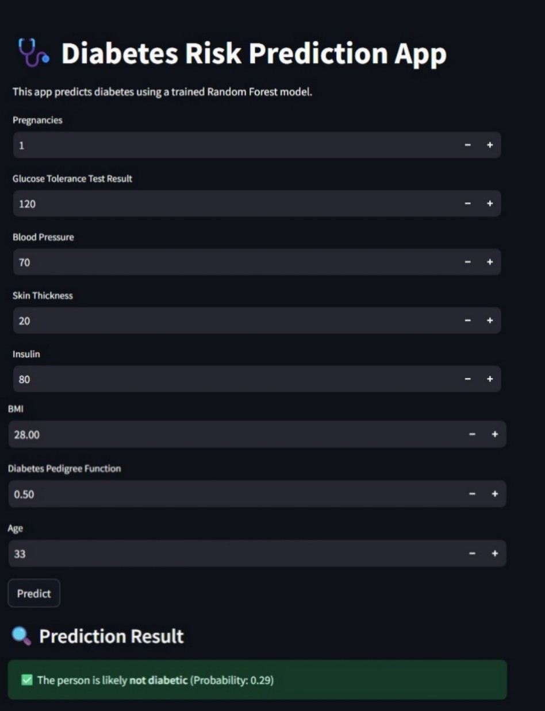

 🩺 Diabetes Risk Prediction App

A simple Streamlit web application that predicts the risk of diabetes using a trained Random Forest model.

---

📂 Project Structure

App.py – Streamlit app for predictions

-dibetes_project.ipynb– Notebook for model training

-rf_model.pkl– Saved trained model

-data_diabetes.csv– Dataset used for training (if available)

---

## 🖼 Screenshot

